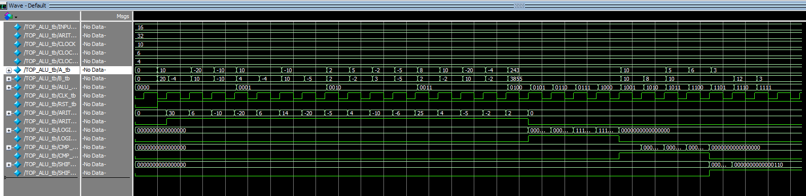

# 16-bits ALU Test Plan

ALU testbench drives only the input of TOP_ALU and monitors its top-level output. The internal functional units are verified indirectly through the integrated top-level design.

Units of the TOP_ALU:

- ARITHMETIC_UNIT
- LOGIC_UNIT
- CMP_UNIT
- SHIFT_UNIT

Following sections describe test cases for each ALU function that is mentioned above.

## ARITHMETIC_UNIT

| # of Tests | ALU_FUN | Operation | Input of A | Input of B | Expected TOP_ALU_out | Arith_flag |
| --- | --- | --- | --- | --- | --- | --- |
| 01. | 0000 | ADD + + | 16'sd10 | 16'sd20 | 32'sd30 | 1'b1 |
| 02. | 0000 | ADD + - | 16'sd10 | -16'sd4 | 32'sd6 | 1'b1 |
| 03. | 0000 | ADD - + | -16'sd20 | 16'sd10 | -32'sd10 | 1'b1 |
| 04. | 0000 | ADD - - | -16'sd10 | -16'sd10 | -32'sd20 | 1'b1 |
| 05. | 0001 | SUB + + | 16'sd10 | 16'sd4 | 32'sd6 | 1'b1 |
| 06. | 0001 | SUB + - | 16'sd10 | -16'sd4 | 32'sd14 | 1'b1 |
| 07. | 0001 | SUB - + | -16'sd10 | 16'sd10 | -32'sd20 | 1'b1 |
| 08. | 0001 | SUB - - | -16'sd10 | -16'sd5 | -32'sd5 | 1'b1 |
| 09. | 0010 | MUL + + | 16'sd2 | 16'sd2 | 32'sd4 | 1'b1 |
| 10. | 0010 | MUL + - | 16'sd5 | -16'sd2 | -32'sd10 | 1'b1 |
| 11. | 0010 | MUL - + | -16'sd2 | 16'sd3 | -32'sd6 | 1'b1 |
| 12. | 0010 | MUL - - | -16'sd5 | -16'sd5 | 32'sd25 | 1'b1 |
| 13. | 0011 | DIV + + | 16'sd8 | 16'sd2 | 32'sd4 | 1'b1 |
| 14. | 0011 | DIV + - | 16'sd10 | -16'sd2 | -32'sd5 | 1'b1 |
| 15. | 0011 | DIV - + | -16'sd20 | 16'sd10 | -32'sd2 | 1'b1 |
| 16. | 0011 | DIV - - | -16'sd4 | -16'sd2 | 32sd2 | 1'b1 |

## LOGIC_UNIT

| # of Tests | ALU_FUN | Operation | Input of A | Input of B | Expected TOP_ALU_out | Logic_flag |
| --- | --- | --- | --- | --- | --- | --- |
| 17. | 0100 | AND | 16'h00F3 | 16'h0F0F | 16'h0003 | 1'b1 |
| 18. | 0101 | OR | 16'h00F3 | 16'h0F0F | 16'h0FFF | 1'b1 |
| 19. | 0110 | NAND | 16'h00F3 | 16'h0F0F | 16'hFFFC | 1'b1 |
| 20. | 0111 | NOR | 16'h00F3 | 16'h0F0F | 16'F000 | 1'b1 |

## CMP_UNIT

| # of Tests | ALU_FUN | Operation | Input of A | Input of B | Expected TOP_ALU_out | CMP_flag |
| --- | --- | --- | --- | --- | --- | --- |
| 21. | 1000 | NOP | - | - | 2'b00 | 1'b1 |
| 22. | 1001 | = | 16'd10 | 16'd10 | 2'b01 else 2'b00 | 1'b1 |
| 23. | 1010 | > | 16'd10 | 16'd8 | 2'b10 else 2'b00 | 1'b1 |
| 24. | 1011 | < | 16'd5 | 16'd10 | 2'b11 else 2'b00 | 1'b1 |

## SHIFT_UNIT

| # of Tests | ALU_FUN | Operation | Input of A | Input of B | Expected TOP_ALU_out | Shift_flag |
| --- | --- | --- | --- | --- | --- | --- |
| 25. | 1100 | >> | 16'b0110 | - | 16'b0011 | 1'b1 |
| 26. | 1101 | << | 16'b0011 | - | 16'b0110 | 1'b1 |
| 27. | 1110 | >> | - | 16'b1100 | 16'b0011 | 1'b1 |
| 28. | 1111 | << | - | 16'b0011 | 16'b0110 | 1'b1 |

## TESTBENCH_RESULTS

```text
# Loading project ALU.2
# Compile of Decoder.v was successful.
# Compile of Arithmetic_unit.v was successful.
# Compile of Logic_unit.v was successful.
# Compile of Cmp_unit.v was successful.
# Compile of Shift_unit.v was successful.
# Compile of Top_module.v was successful.
# Compile of ALU_tb.v was successful.
# 7 compiles, 0 failed with no errors.
vsim -gui work.TOP_ALU_tb
# vsim -gui work.TOP_ALU_tb
# Start time: 22:18:55 on Sep 09,2026
# Loading work.TOP_ALU_tb
# Loading work.TopMod
# Loading work.DecoderUnit
# Loading work.ArithmeticUnit
# Loading work.LogicUnit
# Loading work.CmpUnit
# Loading work.ShiftUnit
add wave -position end  sim:/TOP_ALU_tb/INPUT_WIDTH
add wave -position end  sim:/TOP_ALU_tb/ARITH_OUT_WIDTH
add wave -position end  sim:/TOP_ALU_tb/CLOCK
add wave -position end  sim:/TOP_ALU_tb/CLOCK_HIGH
add wave -position end  sim:/TOP_ALU_tb/CLOCK_LOW
add wave -position end  sim:/TOP_ALU_tb/A_tb
add wave -position end  sim:/TOP_ALU_tb/B_tb
add wave -position end  sim:/TOP_ALU_tb/ALU_FUN_tb
add wave -position end  sim:/TOP_ALU_tb/CLK_tb
add wave -position end  sim:/TOP_ALU_tb/RST_tb
add wave -position end  sim:/TOP_ALU_tb/ARITH_OUT_tb
add wave -position end  sim:/TOP_ALU_tb/ARITH_FLAG_tb
add wave -position end  sim:/TOP_ALU_tb/LOGIC_OUT_tb
add wave -position end  sim:/TOP_ALU_tb/LOGIC_FLAG_tb
add wave -position end  sim:/TOP_ALU_tb/CMP_OUT_tb
add wave -position end  sim:/TOP_ALU_tb/CMP_FLAG_tb
add wave -position end  sim:/TOP_ALU_tb/SHIFT_OUT_tb
add wave -position end  sim:/TOP_ALU_tb/SHIFT_FLAG_tb
run
# TEST 01 --- Addition: (+) + (+) ---
# TEST PASSED: 10 + 20 = 30
#
# TEST 02 --- Addition: (+) + (-) ---
# TEST PASSED: 10 + -4 = 6
#
# TEST 03 --- Addition: (-) + (+) ---
# TEST PASSED: -20 + 10 = -10
#
# TEST 04 --- Addition: (-) + (-) ---
# TEST PASSED: -10 + -10 = -20
#
# TEST 05 --- Subtraction: (+) - (+) ---
# TEST PASSED: 10 - 4 = 6
#
# TEST 06 --- Subtraction: (+) - (-) ---
# TEST PASSED: 10 - -4 = 14
#
# TEST 07 --- Subtraction: (-) - (+) ---
# TEST PASSED: -10 - 10 = -20
#
# TEST 08 --- Subtraction: (-) - (-) ---
# TEST PASSED: -10 - -5 = -5
#
# TEST 09 --- Multiplication: (+) * (+) ---
# TEST PASSED: 2 * 2 = 4
#
# TEST 10 --- Multiplication: (+) * (-) ---
# TEST PASSED: 5 * -2 = -10
#
# TEST 11 --- Multiplication: (-) * (+) ---
# TEST PASSED: -2 * 3 = -6
#
# TEST 12 --- Multiplication: (-) * (-) ---
# TEST PASSED: -5 * -5 = 25
#
# TEST 13 --- Division: (+) / (+) ---
# TEST PASSED: 8 / 2 = 4
#
# TEST 14 --- Division: (+) / (-) ---
# TEST PASSED: 10 / -2 = -5
#
# TEST 15 --- Division: (-) / (+) ---
# TEST PASSED: -20 / 10 = -2
#
# TEST 16 --- Division: (-) / (-) ---
# TEST PASSED: -4 / -2 = 2
#
# TEST 17 --- A AND B ---
# TEST PASSED: f3 AND f0f = 3
#
# TEST 18 --- A OR B ---
# TEST PASSED: f3 OR f0f = fff
#
# TEST 19 --- A NAND B ---
# TEST PASSED: f3 NAND f0f = fffc
#
# TEST 20 --- A NOR B ---
# TEST PASSED: f3 NOR f0f = f000
#
# TEST 21 --- NOP ---
# TEST PASSED: NOP
#
# TEST 22 --- Equal ---
# TEST PASSED: A = 10 Equal B = 10: 1
#
# TEST 23 --- Greater than ---
# TEST PASSED: A = 10 Greater than B = 8: 10
#
# TEST 24 --- Less than ---
# TEST PASSED: A = 5 Less than B = 10: 11
#
# TEST 25 --- Input A Right Shift by 1 ---
# TEST PASSED: A = 6 right shifted by 1 11
#
# TEST 26 --- Input A Left Shift by 1 ---
# TEST PASSED: A = 3 left shifted by 1 110
#
# TEST 27 --- Input b Right Shift by 1 ---
# TEST PASSED: B = 12 right shifted by 1 110
#
# TEST 28 --- Input B Left Shift by 1 ---
# TEST PASSED: B = 3 left shifted by 1 110
```

## WAVEFORM_SAMPLE


